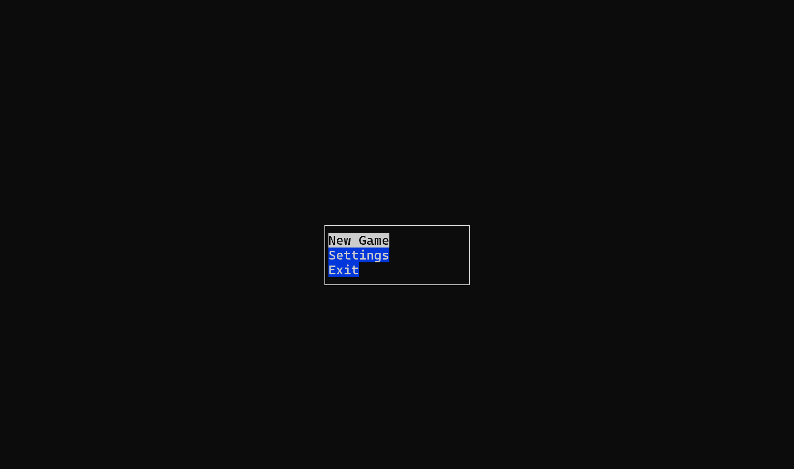
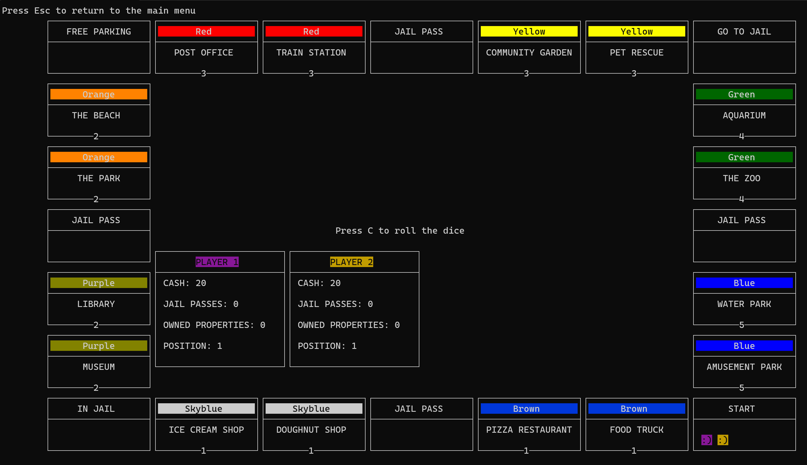

# MONOPOLY

This is a Monopoly game project written in C using the `ncurses` library for visualization.

I've done this project for my Programmin 2 subject at University.

All have been tested on Cygwin compiler.

Scales could be different, depends on monitor resolution.
<h1>Menu view</h1>



<h1>Game view</h1>



## Requirements

- CMake 
- C compiler
- `ncurses` library

## Installation

1. Ensure you have CMake and a C compiler installed.
2. Clone the repository:
    ```sh
    git https://github.com/ArsenLabovich/Monopoly-Ncurses-C-project
    cd Monopoly-Ncurses-C-project
    ```
3. Create and navigate to the build directory:
    ```sh
    mkdir build
    cd build
    ```
4. Run CMake and build the project:
    ```sh
    cmake ..
    make
    ```

## Running the Game

After a successful build, run the following command to start the game:

enter fullscreen mode to better display.

  ```sh
  ./MONOPOLY
  ```
Arsen Labovich
